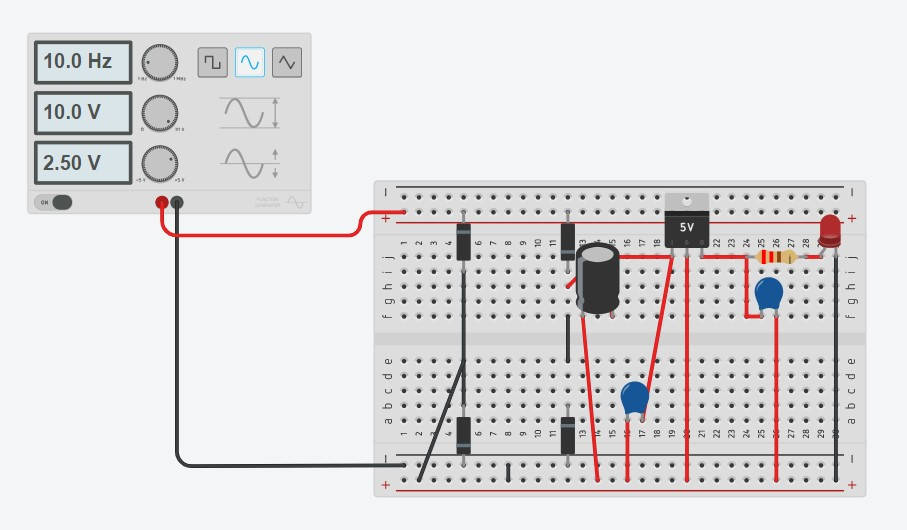
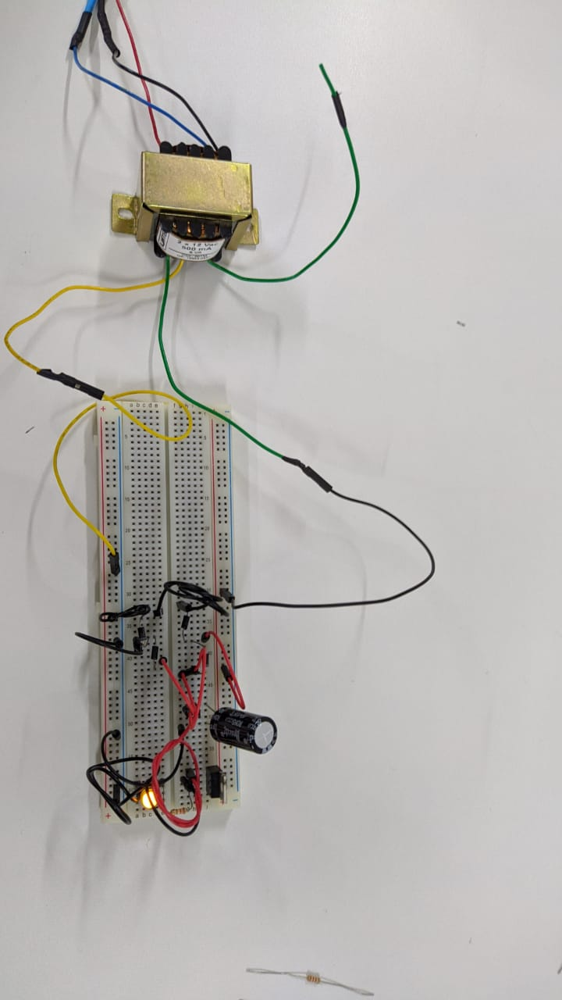
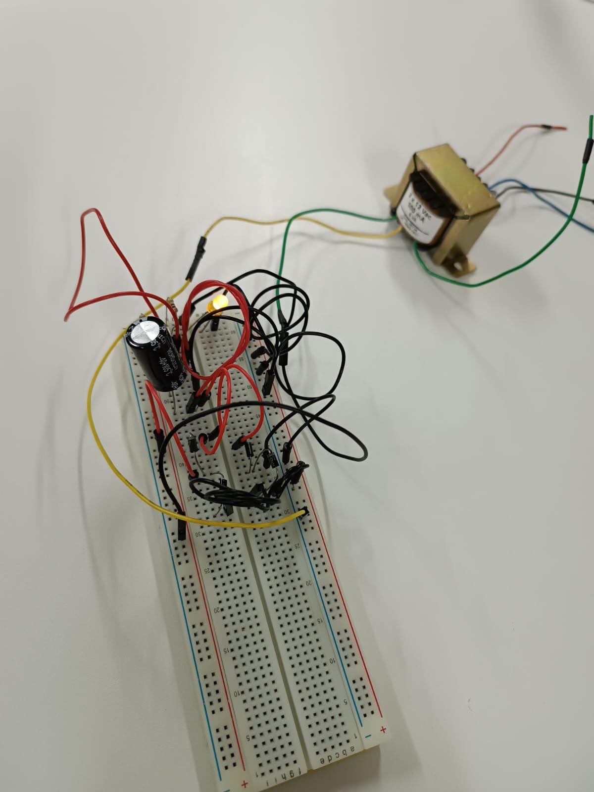
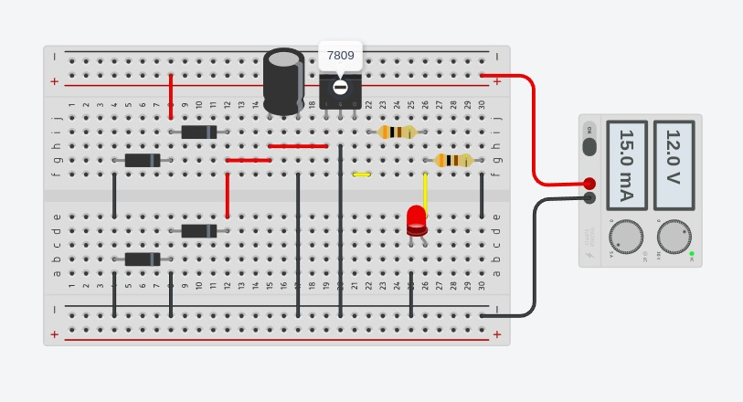

.# Sistemas-Embarcados

Retificador que recebe energia de corrente alternada e transforma em energia de corrente continua

Retificador

   

<a href="https://github.com/RoniEdu">

   

   

   
  

   
   
   
  
Circuito Retificador com LM7805

  
     
  
Circuito Retificador com LM7809 e com o divisor de tensão

  
     
  

     
  

