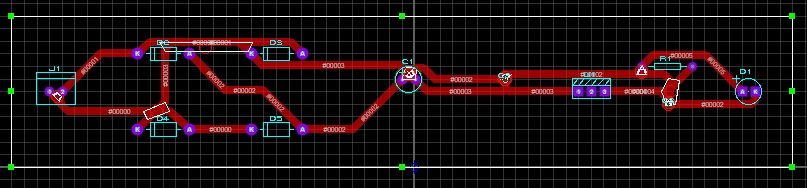

# Sistemas-Embarcados

Retificador que recebe energia de corrente alternada e transforma em energia de corrente continua

Retificador

   

<a href="https://github.com/RoniEdu">

   

   

 
  

   
   
   
  
Circuito Retificador com LM7805

  
     
  
Circuito Retificador com LM7809 e com o divisor de tensão

  
     
  

     
  

  
  
 

   
O código desenvolvido que está apresentado logo a baixo faz com que um dos leds ligue a cada 5 segundos, por outro lado o outro led liga quando o display atinge a temperatura de 26 Celsius.

   
   
#include <Arduino.h>
#include <Arduino_FreeRTOS.h>
#include <LiquidCrystal.h>

#define LED_PIN_1 4
#define LED_PIN_2 2

LiquidCrystal lcd(12,11,10,9,8,7);

// protótipos para as tarefas
void TaskReadTemperature(void *pvParameters);
void TaskLED(void *pvParameters);
void TaskTemperatura(void *pvParameters);

// Variável para armazenar a temperatura lida
volatile float temperature = 0.0;

void setup() {
 Serial.begin(9600);
 lcd.begin(16,2);

pinMode(LED_PIN_1, OUTPUT);
pinMode(LED_PIN_2, OUTPUT);

 // cria as tarefas
 xTaskCreate(
 TaskReadTemperature,
 "ReadTemperature",
 128,
 NULL,
 3,
 NULL );
//Crie as outras tarefas aqui
xTaskCreate(
  TaskLED, //função da tarefas - Ponteiro
    "LED",
    128,
    NULL,
    2,
    NULL );

xTaskCreate(
  TaskTemperatura, //função da tarefas - Ponteiro
    "Temperatura",
    128,
    NULL,
    1,
    NULL );

}
void loop() {
 // nada aqui!
}

void TaskReadTemperature(void *pvParameters) {
 (void) pvParameters;
 float sensorValue = 0.0;
 for (;;) {
 // Aqui você normalmente leria o valor do sensor de temperatura.
 // Por simplicidade, vamos apenas simular um sensor variando a
//temperatura de -10 a 40.
 sensorValue = -10.0 + (rand() % 51); // gera um número aleatório entre
//-10 e 40
 temperature = sensorValue;
 vTaskDelay(2000 / portTICK_PERIOD_MS); // aguarda por 2 segundos
 lcd.setCursor(0,0);
 lcd.print("Temp: ");
 lcd.print(temperature);
 lcd.print(" C");

 // vTaskDelay(1000 / portTICK_PERIOD_MS);
 }
}
//Continue...

void TaskLED(void *pvParameters){
    (void) pvParameters;
    for (;;){//loop infinito
        digitalWrite(LED_PIN_1, HIGH);
        vTaskDelay(500 / portTICK_PERIOD_MS); //
        digitalWrite(LED_PIN_1, LOW);
        vTaskDelay(500 / portTICK_PERIOD_MS); //
    }
}

void TaskTemperatura(void *pvParameters){
    (void) pvParameters;
    for (;;){//loop infinito
      if (temperature == 26){

        digitalWrite(LED_PIN_2, HIGH);
        vTaskDelay(5000 / portTICK_PERIOD_MS); //
        digitalWrite(LED_PIN_2, LOW);
        vTaskDelay(5000 / portTICK_PERIOD_MS); //
      }  
    }
}
     
     

